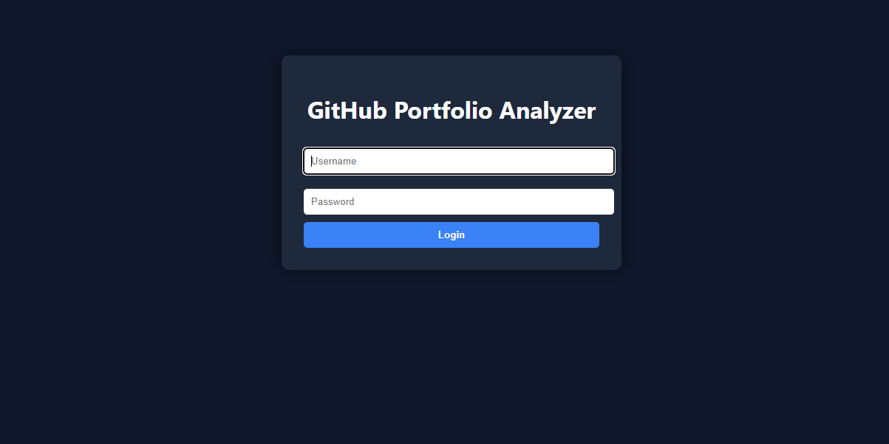
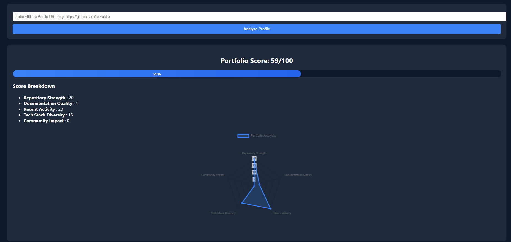
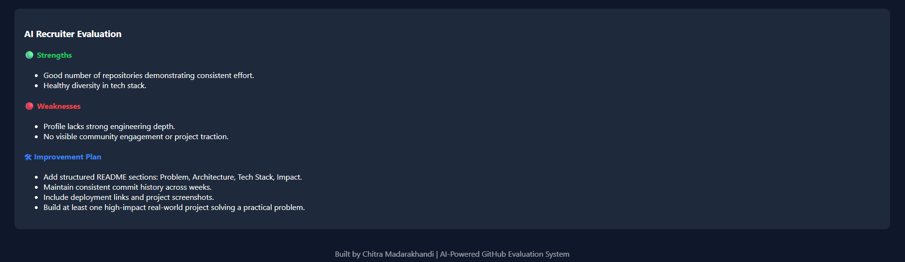

# 🚀 GitHub Portfolio Analyzer & Enhancer

An AI-powered system that evaluates GitHub profiles the way recruiters do — by identifying strong engineering signals, weaknesses, and actionable improvements.

---

## 🔗 Live Demo
👉 https://github-portfolio-analyzer-1.onrender.com 

⚠️ Free-tier hosting may take 20–30 seconds to wake up.

##🌐 Demo_vedio_link
👉 https://drive.google.com/drive/folders/1wu7OSe8rcWxbqRu10qNRWGnJ9HGLE7Tc

---

## 📸 Preview


### 🖥️ Dashboard Overview


### 📊 Radar Chart Visualization


### 🤖 AI Recruiter Feedback


### 🚀github-portfolio-analyzer output


---

## 🎯 Problem Statement

GitHub is the primary portfolio for developers, yet most profiles fail to clearly signal skill, consistency, and real-world impact to recruiters.

This project bridges that gap by converting raw GitHub activity into structured recruiter-style insights.

---

## 🧠 Core Features

- 📊 Structured Portfolio Scoring (0–100)
- 📈 Radar Chart Visualization
- 🧮 Signal-Based Evaluation:
  - Repository Strength
  - Documentation Quality
  - Recent Activity
  - Tech Stack Diversity
  - Community Impact
- 🤖 AI Recruiter Feedback (LLM + Deterministic Fallback)
- 🔐 Secure Login & Session Management
- 🌐 Live Public Deployment (Render)

---

## 🚀 How to Run Locally

Follow these steps to run the project on your local machine:


### 1️. Clone the Repository

```bash
git clone https://github.com/chitramadarakhandi/github-portfolio-analyzer.git
cd github-portfolio-analyzer

2️.Create Virtual Environment
python -m venv venv

Windows:
venv\Scripts\activate

Mac/Linux:
source venv/bin/activate

3.Run the Application
uvicorn main:app --reload

4. i/p example
input should be git profile url
(ex: https://github.com/username)
-->if the url as shown in the example then only tool will analyze evrything

--------------------------------


