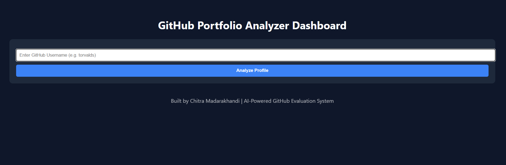
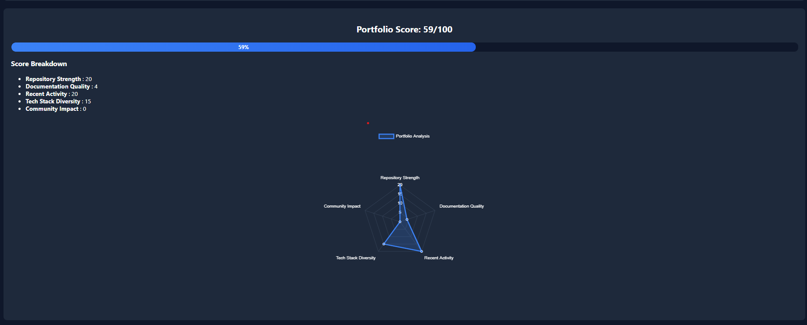
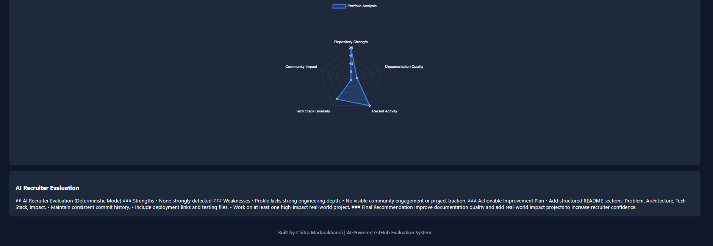
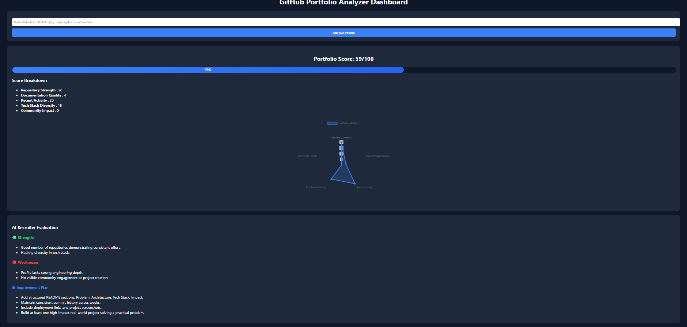

# 🚀 GitHub Portfolio Analyzer & Enhancer

An AI-powered system that evaluates GitHub profiles the way recruiters do — by identifying strong engineering signals, weaknesses, and actionable improvements.

---

## 🔗 Live Demo
👉 https://github-portfolio-analyzer-1.onrender.com 

⚠️ Free-tier hosting may take 20–30 seconds to wake up.

---

## 📸 Preview

### 🖥️ Dashboard Overview

### 📊 Radar Chart Visualization

### 🤖 AI Recruiter Feedback

### 🚀github-portfolio-analyzer output

---

## 🎯 Problem Statement

GitHub is the primary portfolio for developers, yet most profiles fail to clearly signal skill, consistency, and real-world impact to recruiters.

This project bridges that gap by converting raw GitHub activity into structured recruiter-style insights.

---

## 🧠 Core Features

- 📊 Structured Portfolio Scoring (0–100)
- 📈 Radar Chart Visualization
- 🧮 Signal-Based Evaluation:
  - Repository Strength
  - Documentation Quality
  - Recent Activity
  - Tech Stack Diversity
  - Community Impact
- 🤖 AI Recruiter Feedback (LLM + Deterministic Fallback)
- 🔐 Secure Login & Session Management
- 🌐 Live Public Deployment (Render)

---

